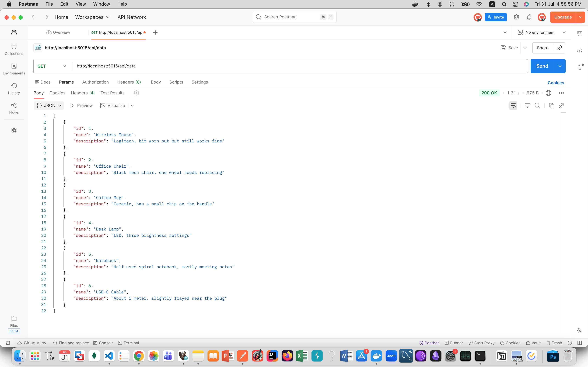
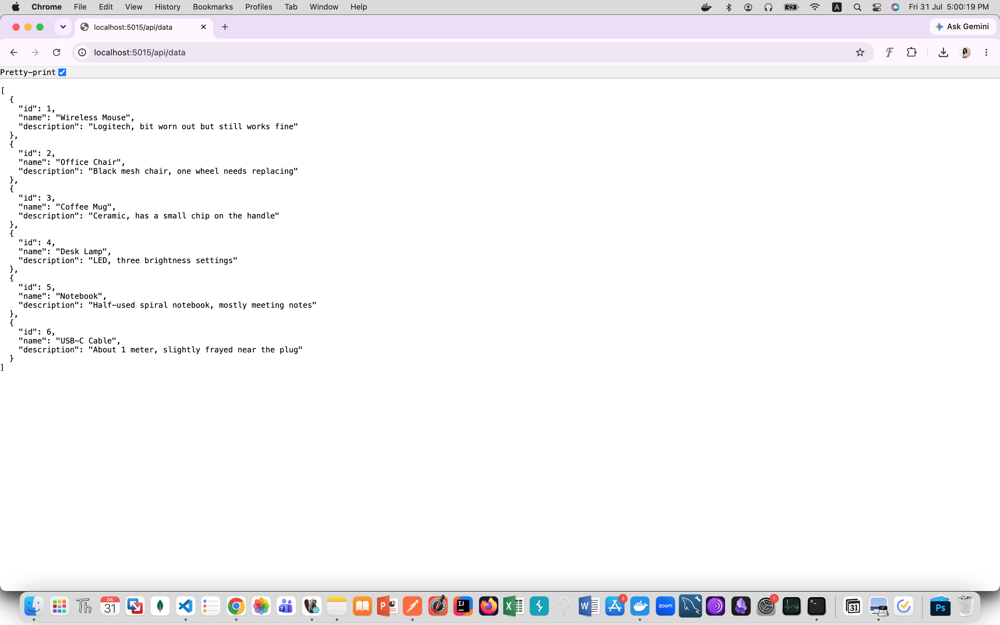

_This projet was made by Nour Mina as part of the IDS Fintech Backend Training Program_

# IDS Fintech Assignment 2 - API Project

_in this file, i will be sharing all notes i have taken while working on the project but did not include in the code files. This is to help me remember what i have done and why i have done it_

## 1. Request to Response Flow

Postman GET request → Controller → Service → CachedDataRepository → DataRepository → SQL Server

Each layer knows about the layer below it through interfaces and not through concrete classes.

## 2. Project Setup

### 2.1 Create the project

An automatic builder generates a new ASP.NET Core Web API project from a template.

```
dotnet new webapi -n IDS_API_Project -controllers
```

→ `new webapi` tells dotnet which template to use. It sets up a project pre-wired for HTTP endpoints, Swagger and a controllers folder.
→ `-n IDS_API_Project` names the project and the folder it creates.
→ `-controllers` includes controller based routing (the `[ApiController]` style) instead of the newer minimal API style.

### 2.2 Gitignore

Instead of typing the gitignore by hand, generate a pre-made list with this command.

```
dotnet new gitignore
```

## 3. File Types

### 3.1 C# files

`.cs` is the C# file extension.

### 3.2 Project files

`.csproj` is the C# Project file. It manages dependencies and build settings.

### 3.3 Web Forms

`.aspx` is an ASP.NET Web Forms file containing server side C# code.

### 3.4 Program.cs

When the project starts, the computer reads this file first.
It sets up the web server, turns on security features and launches the site.

## 4. Packages

After the project setup, add these packages.

```
dotnet add package Dapper
dotnet add package Microsoft.Data.SqlClient
dotnet add package DotNetEnv
```

### 4.1 Dapper

Dapper is a popular Micro ORM built by Stack Overflow.
It automatically converts SQL query results into C# objects so we do not have to map them manually.

### 4.2 Microsoft.Data.SqlClient

This is the official SQL Server driver. It gives the `SqlConnection` used to connect.

### 4.3 DotNetEnv

This package lets the project load environment variables from a `.env` file.

## 5. Connection String Setup

### 5.1 appsettings.json (before env)

```
"ConnectionStrings": {
  "Default": "Server=localhost,1433;Database=DummyDataDb;User Id=SA;Password=Secret;TrustServerCertificate=True;"
}
```

### 5.2 The env flow

```
.env
  ↓
Env.Load()
  ↓
Environment.GetEnvironmentVariable()
  ↓
create the connection string
  ↓
put it inside builder.Configuration
  ↓
use GetConnectionString() normally
```

### 5.3 The .env file

```
DB_SERVER=localhost,1433
DB_NAME=DummyDataDb
DB_USER=SA
DB_PASSWORD=YourStrong!Passw0rd
```

### 5.4 Program.cs code

```
using DotNetEnv;

Env.Load();

var builder = WebApplication.CreateBuilder(args);

var server = Environment.GetEnvironmentVariable("DB_SERVER");
var database = Environment.GetEnvironmentVariable("DB_NAME");
var user = Environment.GetEnvironmentVariable("DB_USER");
var password = Environment.GetEnvironmentVariable("DB_PASSWORD");

var connectionString = $"Server={server};" + $"Database={database};" + $"User Id={user};" + $"Password={password};" + $"TrustServerCertificate=True;";
builder.Configuration["ConnectionStrings:Default"] = connectionString;

builder.Services.AddControllers();
builder.Services.AddOpenApi();

var app = builder.Build();
```

### 5.5 appsettings.json (after env)

```
{
  "ConnectionStrings": {
    "Default": ""
  },
  "Logging": {
    "LogLevel": {
      "Default": "Information",
      "Microsoft.AspNetCore": "Warning"
    }
  },
  "AllowedHosts": "*"
}
```

You can also remove `Default` completely if you want.

## 6. Full Request Lifecycle

```
User
  ↓
GET /api/data
  ↓
DataController
  ↓
_service.GetAll()
  ↓
DataService
  ↓
_repo.GetAll()
  ↓
CachedDataRepository
  ↓
Is it cached?
  ↓
YES → Return data
  ↓
NO
  ↓
DataRepository
  ↓
SQL Query
  ↓
Database
  ↓
Returns data
  ↓
Repository
  ↓
Service
  ↓
Controller
  ↓
return Ok(data)
  ↓
User receives JSON
```

## 7. Postman Testing

Postman is a tool for testing APIs. It can send requests and display responses.


And since our API is a simple GET endpoint, we can also test it in the browser after typing the api URL in the address bar and hitting enter.


**annnd that's it. thank you for reading my notes :)**
