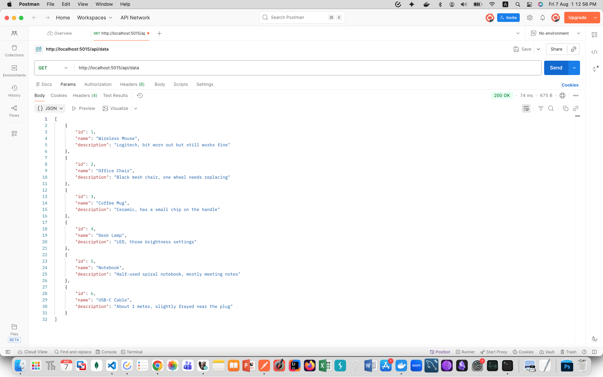
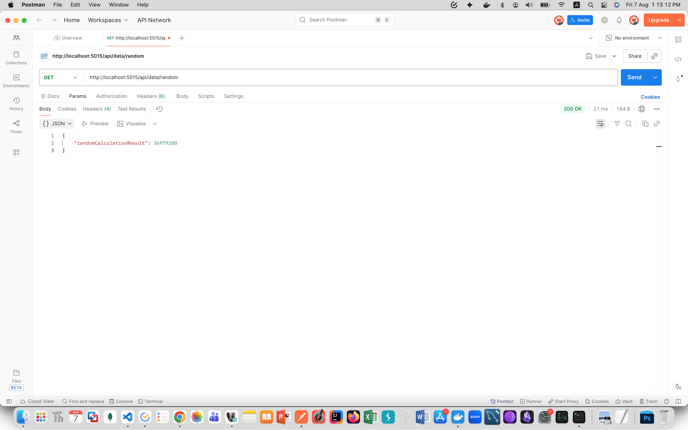

_This projet was made by Nour Mina as part of the IDS Fintech Backend Training Program_

# IDS Fintech Assignment 3 - Async Project

_in this file, i will be sharing all notes i have taken while working on the project but did not include in the code files. This is to help me remember what i have done and why i have done it_

## 1. What Changed From Assignment 2

Assignment 2 had a working API but it was not using **async**. For this assignment, the goal was to make the whole request path async and add a new endpoint that uses a **Task** with a continuation.

## 2. What Async Actually Means Here

The base of it is the Task-based Asynchronous Pattern (TAP). Basically `Task` and `Task<T>` are objects that represent work that is still going on, not work that already finished.

`async` and `await` are keywords that were added so we can write async code that still reads like normal sequential code. Without them we would have to write callbacks everywhere which is way harder to do.

When a method is marked `async`, the compiler does not just run it normally. It rewrites it behind the scenes into something called a **state machine**. That state machine is what lets the method pause at an `await` and continue later without blocking the thread.

### 2.1 What the compiler is doing (from what i understood)

There are 4 things happening when an async method runs:

1. **Compiler Transformation**: the compiler takes the async method and turns it into a state machine, so it knows how to pause and resume it.
2. **State Machine Generation**: every `await` in the method becomes a new "state". The state machine remembers which state it stopped on.
3. **Variable Spilling**: any local variable that is still needed after an `await` gets saved inside the state machine, so the data is not lost when the method pauses.
4. **Continuation Scheduling**: if the awaited task is not done yet, the method returns control back to whoever called it, and schedules the rest of the method to run later once the task finishes. That "rest of the method" is the continuation.

## 3. Rules i Followed

### 3.1 Async all the way

If one method is async, everything calling it should also be async, all the way up. Also, never call `.Result` or `.Wait()` on a task, because these block the thread and can cause deadlocks.

_So in this project, as explained: Controller awaits Service, Service awaits Repository, Repository awaits Dapper's `QueryAsync`. No blocking anywhere in the chain._

### 3.2 Never return void from async methods

`async void` should only be used for event handlers. Every other async method should return `Task` or `Task<T>`, otherwise exceptions thrown inside it cannot be caught properly and the caller has no way to await it.

## 4. Request to Response Flow

Postman GET request → Controller → Service → CachedDataRepository → DataRepository → SQL Server

Same flow as Assignment 2, just every step in this chain now uses `await` instead of blocking calls.

## 5. The Two Endpoints

### 5.1 GET /api/data

This is the same endpoint as before but now async top to bottom.

### 5.2 GET /api/data/random

This one is new. It uses `Task.Run` to start a random calculation on a background thread (since its CPU work, not I/O work). Then it uses `.ContinueWith()` to create a continuation that picks up the result once the task is done. Then that continuation gets awaited so the controller can return the final result.

## 6. Proving Async Actually Works (Thread Print Test)

To actually see the async working and not just trust that it is, i added a small loop at the top of both endpoints that prints the current thread id 5 times with a delay between each print.

### 7.1 How i tested it

Ran the app with `dotnet run` in one terminal, then in a second terminal fired both endpoints at the same time using to background them so they hit the server together:

curl http://localhost:5015/api/data & curl http://localhost:5015/api/data/random &

Then watched the **first terminal** (the one running `dotnet run`), since thats where `Console.WriteLine` actually prints, not the terminal that sent the curl.

### 7.2 What i got

Thread 8 (GET /api/data): 1
Thread 7 (GET /api/data/random): 1
Thread 8 (GET /api/data/random): 2
Thread 7 (GET /api/data): 2
Thread 7 (GET /api/data): 3
Thread 8 (GET /api/data/random): 3
Thread 7 (GET /api/data/random): 4
Thread 11 (GET /api/data): 4
Thread 7 (GET /api/data): 5
Thread 7 (GET /api/data/random): 5

### 7.3 What this actually shows

Two things:

1. **The two requests are interleaved.**
   Lines from `/api/data` and `/api/data/random` are mixed together instead of one finishing completely before the other starts. If this was blocking/sync code, one endpoint would print all 5 of its lines first, then the other would start.

2. **The thread id changes mid-request.** Look at `/api/data`, it printed on Thread 8, then Thread 7, then Thread 11, then back to Thread 7. This connects to the "Continuation Scheduling" part i wrote about earlier, every time the code hits `await Task.Delay(500)`, the method pauses and gives its thread back to the thread pool. Once the delay is done, whatever thread is free at that moment picks the method back up, not necessarily the same one it started on. So the request is not "holding" a thread the whole time, its more like it borrows one, pauses, and grabs whichever one is free when its ready to continue.

This is basically the state machine from section 2 in action, i can actually see it jumping between states/threads instead of just reading about it.

## 7. Postman Testing

_this pic shows the first data GET_

_and this shows the second within 10 mins (cached is faster)_

_lastly, this is the GET of the random_

**annnd that's it. if you're still here thank you :)**
